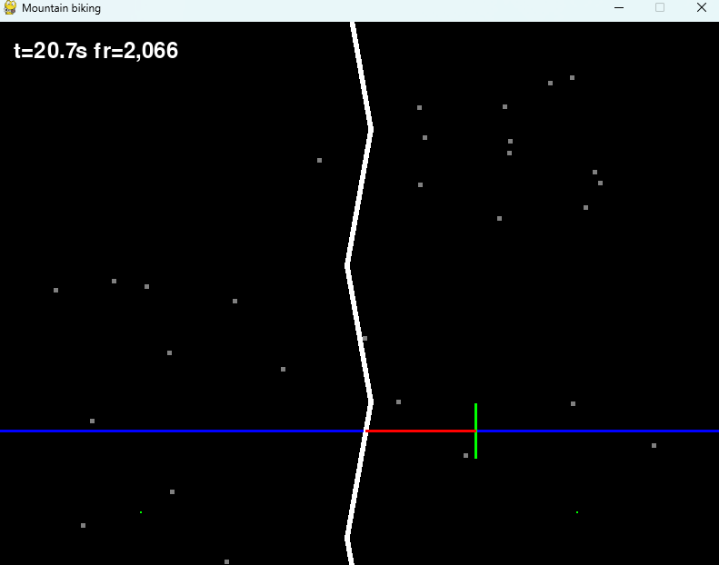

# EEG recording during mountaing biking game


Check the YouTube Video: https://youtu.be/ZFiBm52qkF8

## Requirements
* Python 3.9+
* pygame

## Usage notes

### Using pygame for steering
When using a joystick or keyboard (bang bang control), you can use the pygame version of the code. pygame can also read the Logitech G27 steering wheel as shown in the video.

When using pygame, joystick can capture the wheel information from the pygame joystick class using the generic windows HID game controller driver. But this does not give access to torque feedback contrrol.

### Using torque feedback with G27 Logitech wheel

Needs windows OS to use the Doyle lab G27 steering wheel, it is essential to install an older version 5.10 of Logitech Game software

https://support.logi.com/hc/en-hk/articles/360024699674--Downloads-G27-Racing-Wheel

On Windows 11 you must turn off data integriry core protection to use this driver.

### Launching game

Just run mountain_biking:
```python
python mountain_biking.py
```
